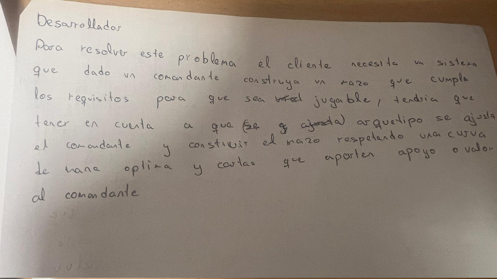

# MagicOptimizer

## (Conceptos Básicos)
Para entender el problema, es necesario conocer unas breves reglas estructurales del formato Commander del juego de cartas Magic: The Gathering:
* El Comandante y la Identidad de Color: Cada jugador elige una carta líder (el "Comandante"). Los colores de esta carta dictan estrictamente qué colores pueden tener las demás cartas del mazo.
* Restricción de Tamaño Exacto: Un mazo de Commander tiene exactamente 100 cartas (el Comandante + 99 cartas únicas). 
* Tierras y Recursos: Para poder jugar cartas, se necesita "maná" (la moneda del juego). Este maná lo producen unas cartas llamadas "Tierras". Un mazo de 100 cartas necesita matemáticamente unas 36 tierras para funcionar, dejando unos 63 huecos para las cartas de acción.
* Sinergia y Arquetipos: Las cartas no se eligen al azar. Deben tener relación mecánica con el Comandante (por ejemplo, si el Comandante potencia a los Elfos, el mazo debe estar lleno de Elfos). A estos estilos de juego se les llama "Arquetipos".
* Curva de Maná: Es la distribución estadística de los costes numéricos de las cartas (`cmc`). Un mazo necesita una campana de Gauss en sus costes (cartas baratas para el principio, algunas caras para el final) para no quedarse bloqueado en la partida.

## El Problema
Un amigo mío juega habitualmente a Magic Commander en formato físico. Construir un mazo desde cero le toma dias de planificación. Cuando elige un nuevo Comandante, tiene que lidiar con un catálogo histórico de más de 25.000 cartas. 

El problema es que le cuesta muchísimo trabajo saber qué conjunto exacto de 99 cartas maximiza la sinergia con su Comandante mientras mantiene una curva de maná perfecta, la proporción exacta de tierras y una cantidad viable de cartas de soporte. Si elige a ojo, acaba con mazos inconsistentes donde las cartas no interactúan entre sí o donde roba cartas demasiado caras que no puede jugar. Encontrar la combinación óptima analizando los textos de las 25.000 cartas es un problema de optimización combinatoria y procesamiento de lenguaje que sobrepasa la capacidad de cálculo mental de un humano.

## Lógica de Negocio
Para resolver este problema, la aplicación toma como única entrada la carta seleccionada como Comandante. A partir de ahí, el sistema ejecuta de forma autónoma la siguiente lógica computacional:

1. Filtrar (Filtrado Absoluto): El motor descarta de la base de datos las cartas que no son legales en el formato y elimina estrictamente todas aquellas que no coinciden con la identidad de color del Comandante.
2. Extraer e Inferir (Inferencia de Arquetipo): Mediante procesamiento de cadenas sobre el tipo y el texto de reglas del Comandante, el algoritmo deduce cuál de los 4 arquetipos de juego principales es el óptimo para esa carta (Tribal, Spellslinger, Voltron o Tokens).
3. Calcular : Por cada carta candidata $C$ que superó el filtro, se calcula una puntuación de sinergia unificada $S(C)$ normalizada. Esta ecuación utiliza tres factores ($M, E, R$) y tres pesos ponderados ($p_m, p_e, p_r$) que suman 1. 
   
   $S(C)$ = $p_m$ x $M(C)$ + $p_e$ x $E(C)$ + $p_r$ x $R(C)$
   * $M(C)$ (Coincidencia Mecánica): Utiliza álgebra booleana para evaluar la compatibilidad del texto. Por ejemplo, si el arquetipo es Tribal ("Goblin"), se evalúan variables booleanas: $B_{tipo}$ (si el tipo incluye Goblin) y $B_{texto}$ (si el texto menciona "Goblin"). El motor aplica: $M(C)$ = (0.6 x $B_{tipo}$) + (0.4 x $B_{texto}$).

   * $E(C)$ (Eficiencia de Maná): Evalúa matemáticamente el coste numérico de la carta (cmc) aplicando un decaimiento exponencial (las cartas más baratas puntúan más alto para garantizar fluidez).

   * $R(C)$ (Rol Estructural): Evalúa si la carta aporta infraestructura vital (robar más cartas o generar maná extra). El motor lo detecta automáticamente aplicando Expresiones Regulares sobre el texto JSON:
     * Robo (Draw): Si la Regex coincide con el texto, la carta se etiqueta internamente como Es_Robo = True.
     * Rampa (Maná): Si el JSON de Scryfall contiene el campo produced_mana(las tierras se excluyen), o si la Regex detecta la palabra land, se etiqueta como Es_Rampa = True.
     * Si alguna es verdadera, se le otorga el máximo valor $R(C) = 1.0$.

   Ajuste Dinámico de las Ponderaciones ($p$) según el Arquetipo:
   * Tribal (Basado en Razas): Requiere una masa crítica de criaturas. $p_m $= 0.7, $p_e$ = 0.2, $p_r$ = 0.1.
   * Spellslinger (Hechizos Rápidos): La eficiencia de maná es crítica. $p_m $= 0.4, $p_e $= 0.5, $p_r $= 0.1.
   * Voltron (Equipamientos): Equilibrio perfecto entre armas y recursos. $p_m$ = 0.5, $p_e$ = 0.3, $p_r $= 0.2.
   * Tokens (Fichas en Masa): Depende mucho de la infraestructura. $p_m $= 0.5, $p_e$ = 0.2, $p_r$ = 0.3.

4. Generar y Maximizar: Una vez puntuadas miles de cartas, no basta con seleccionar las 63 con mayor nota (lo que sería un enfoque Greedy o que generaría un mazo inútil de 63 Goblins y 0 cartas de robo). El sistema resuelve una variante del Problema de la Mochila con restricciones:
   * Tierras Fijas: Reserva aprox 36 huecos, calculando la proporción matemática de tierras básicas según los colores del Comandante.
   * Cuotas Estructurales Mínimas: Impone condiciones inquebrantables. El mazo resultante debe incluir, por ejemplo, MIN_DRAW = 10 (10 cartas etiquetadas como Es_Robo = True) y MIN_RAMP = 10 (Es_Rampa = True). El algoritmo priorizará meter una carta de robo de baja puntuación antes que un Goblin de puntuación perfecta si la cuota de robo aún no se ha cumplido.
   * Curva de Maná: Los huecos restantes se rellenan maximizando la puntuación $S(C)$, pero limitados por una campana de Gauss que penaliza sobrecargar un mismo coste numérico de maná (cmc).

## Necesidad de acceso a la nube
Haría falta desplegar el servicio en la nube porque procesar un JSON con 25.000 cartas utilizando expresiones regulares y álgebra booleana requiere muchos recursos que por ejemplo un móvil no podría soportar.

Otro motivo por el que haria falta el servicio en la nube es para resolver el problema de mochila evaluando restricciones duras (Cuotas estructurales y Campana de Gauss) sobre miles de candidatas exige la capacidad de cálculo y la estructura del servidor.

Por ultimo, el procesamiento pesado lo realizaria el servidor para que desde el móvil solo necesites ingresar el comandante que quieras y te saque el mazo.
## Juego de Rol

 
## Datos 

Los datos que necesitamos se pueden obtener del conjunto de datos de Scryfall. Como los datos se actualizan a diario sera necesario realizar una única petición al día y como Scryfall proporciona un export de todas las cartas en formato JSON se puede descargar previamente y procesarse de forma local.

Fuente: https://api.scryfall.com/bulk-data 

Para el problema planteado se necesitan principalmente los siguientes campos:
* `name`: Identificador de la carta.
* `type_line`: Clasificación estructural. Esencial para calcular variables como el $B_{tipo}$ y asegurar las tierras.
* `oracle_text`: El texto completo con las reglas de la carta. Se procesa con Expresiones Regulares para calcular el $B_{texto}$ y deducir los roles de Rampa y Robo.
* `cmc` (Valor numérico de maná convertido): Para calcular la Eficiencia de Maná $E(C)$ y aplicar las restricciones de la campana de Gauss.
* `produced_mana`: Array indicando si la carta es un acelerador de recursos base.
* `color_identity` y `legalities`: Para el filtrado absoluto inicial.

Un ejemplo seria:\
{\
  "name": "Krenko, Mob Boss",\
  "cmc": 4.0,\
  "type_line": "Legendary Creature — Goblin Warrior",\
  "oracle_text": "{T}: Create X 1/1 red Goblin creature tokens, where X is the number of Goblins you control.",\
  "color_identity": ["R"],\
  "legalities": { "commander": "legal" }\
}
## Licencia de los datos

Los datos utilizados proceden de Scryfall (https://scryfall.com), que los ofrece de forma gratuita al amparo de la Fan Content Policy de Wizards of the Coast,
para la creación de software, investigación o contenido de comunidad relacionado con Magic: The Gathering.  https://company.wizards.com/en/legal/fancontentpolicy

El proyecto cumple esta condición porque los datos se combinan con la lógica de negocio propia descrita más arriba, y no se limita a mostrarlos.

MagicOptimizer es contenido de fan permitido bajo la Fan Content Policy.No aprobado/respaldado por Wizards. Parte de los materiales usados son propiedad de Wizards of the Coast.
©Wizards of the Coast LLC.

## Documentación

[Configuración del repositorio](doc/configuracion.md)
